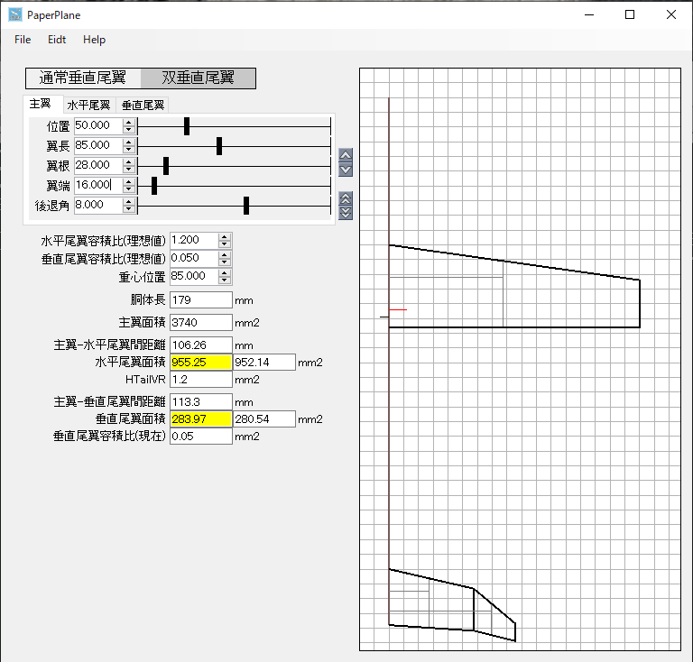

# PaperPlanes
「日本で生まれ育った高性能紙飛行機　その設計・製作・飛行技術のすべて」　二宮康明著の計算式を使用して紙飛行機の設計を行うアプリです。 
電卓片手に計算するのがかなり面倒なので作ったアプリになります 
 
新しいバージョンを作りました。PP.exeです。 
 
普通の尾翼と双尾翼の2種類に対応しています。 
 

# 更新履歴

* v1.0.0 作った。
* v1.0.1 コントロールをカスタム化
* v1.0.2 PDFではなくSVGにエクスポート形式を変更。DXFも 表示解像度の指定も出来るように。
* v1.0.3 DXF/SVG書き出しの時９０度観点させるようにした。重心位置が中心にるようんした。

# Usage
簡単な設計の仕方です。

## 尾翼の種類を選ぶ
後からでも大丈夫ですが、尾翼の形式を選びます。 
「**通常垂直尾翼**」と「**双垂直尾翼**」の二つが選べます。 

## 主翼の大きさを決める
タブで「主翼」「水平尾翼」「垂直」とあるので「主翼」を選び、好きな形にします。 
 
単位はすべてmm(ミリメートル)です。

* **位置** 先頭からの位置。
* **翼長** 中心から翼端までの距離。全長の半分なので注意してください。
* **翼根** 翼の根元の長さ。
* **翼端** 翼の橋の長さ。
* **後退角** 翼の後退角。

グレーの薄い縦線は**空力平均翼弦**(Mean Aeraodynamic Chord以後MAC)を描画しています。横線は**空力中心**(aeridynamic center)になります。 

翼の角をドラッグ＆ドロップで移動することができます。 
タブの右にあるアイコンで「尾翼」の位置を調整できます。 

## 胴体長
胴体長は直接指定できません。水平尾翼の位置で調整します。

## 尾翼容積比(Tail Volume Rate)
尾翼容積比に関しては二宮さんの本のP.24で説明されています。 
尾翼の面積を決めるための値になります。 
このアプリでは、理想値と現在の２個設定があります。 
理想値の値を基に理想的な尾翼の面積を計算し、現在の面積と現在の尾翼容積比と比較しながら尾翼の形を決める手順になります。

## 水平尾翼　垂直尾翼
面積の表示で左が「現在の面積」右が「尾翼容積比（理想値）によって計算された面積」になります。
つまり、右の値になるように形を変えて左の値を変えることにより面積を決定します。 
面積の値が近くなると、グレーになりほぼ同じになると黄色になります。 

## 重心
黒い横線はMACの85%の位置で重心になります。 
赤い線は違う方式での重心位置です。 
二宮さんの本のP.38にある**重心位置簡易算出法**の(1)(2)が黒い線、(3)で求められる位置が赤い線になります。 
このアプリでの重心の位置決定はやはり目安で実際に飛ばして確認後決定したほうがよく飛びます。

## 微調整
その後、好きなように微調整して決め込んでいきます。

## SVGに書き出す。
FileメニューのExportSVGでSVGに書き出せます。SVGは**Adobe Illustrator**(**Inkscape**でも可)で修正することを想定しています。 
SVGをDXFに変換して**Autodesk FUSION**に持ち込んで編集してもかまいません。 
PDFからSVGに変えました。PDFよりライブラリが小さくてIllustratorで扱いやすかったので。

# その他

画面の解像度は83dpiで描画していますので27型(1980x1082)のディスプレイなら実寸サイズになります。

# 今後

自分が使うために作っているので、細かいところで使いにくいところがあります。
解像度固定とか、色とか。 
こんごそこら辺を調整したいと思ってます。 

# License

This software is released under the MIT License, see LICENSE. 

# Authors

bry-ful(Hiroshi Furuhashi) 
twitter:[bryful](https://twitter.com/bryful) 
bryful@gmail.com 

# References
[「日本で生まれ育った高性能紙飛行機　その設計・製作・飛行技術のすべて」　二宮康明著](https://www.amazon.co.jp/%E9%AB%98%E6%80%A7%E8%83%BD%E7%B4%99%E9%A3%9B%E8%A1%8C%E6%A9%9F-%E3%81%9D%E3%81%AE%E8%A8%AD%E8%A8%88%E3%83%BB%E8%A3%BD%E4%BD%9C%E3%83%BB%E9%A3%9B%E8%A1%8C%E6%8A%80%E8%A1%93%E3%81%AE%E3%81%99%E3%81%B9%E3%81%A6-%E4%BA%8C%E5%AE%AE-%E5%BA%B7%E6%98%8E/dp/4416313071)

